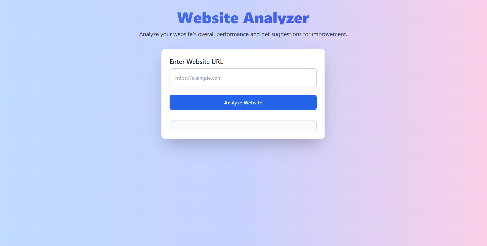

<h1 align="center">🔍 WEBcheck</h1>

  
  
  
  

  🧠 A smart website structure analyzer and classifier built using Python and Jupyter Notebook. 
  It breaks down any website’s anatomy and gives insights on its structure, layout, and category.

---

## ✨ Features

- 🧩 **Analyze** structure and components of any website
- 📊 **Generate** CSV reports with tags, links, scripts, etc.
- 🔎 **Classify** websites by features like form, media, interaction
- 📁 Organized with `client`, `server`, and `data` folders
- 📓 Interactive Jupyter Notebook for hands-on analysis

---

## 🎯 Tech Stack

| Category        | Tech                                      |
|----------------|-------------------------------------------|
| Language        |  |
| Frontend        | HTML, CSS                                 |
| Backend         | Python Flask (optional)                   |
| Notebook Tool   | Jupyter Notebook                          |
| Data Format     | CSV, JSON                                 |

---

## 📸 Screenshot

---

## 📂 Folder Structure

WEBcheck/
├── client/ # Frontend (HTML/CSS/JS)
├── server/ # Backend (optional)
├── data/ # CSV datasets and results
├── website_analyzer.ipynb # Jupyter notebook to run
├── website_analysis_results.csv
├── website_classification.csv
├── screenshot.png
└── README.md

💡 What I Learned
Web scraping and HTML parsing using Python

DOM structure analysis

Feature extraction from websites

Data manipulation with Pandas

Using Jupyter for interactive development

## 🙋‍♀️ Author
Made with ❤️ by Pritidarshini Biswal

🌱 Beginner-friendly project combining data science and web development — more to come soon!
